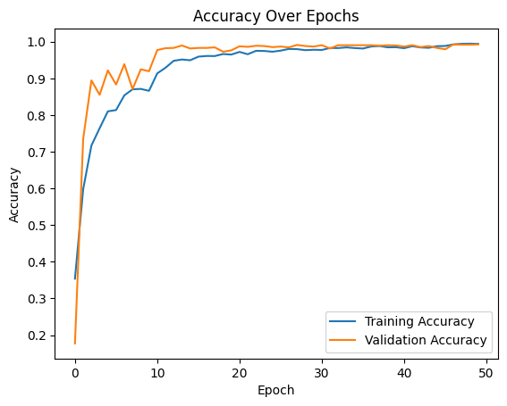
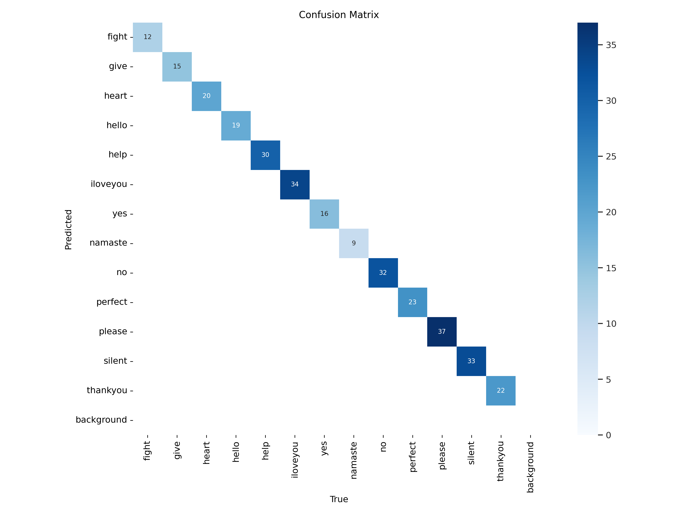
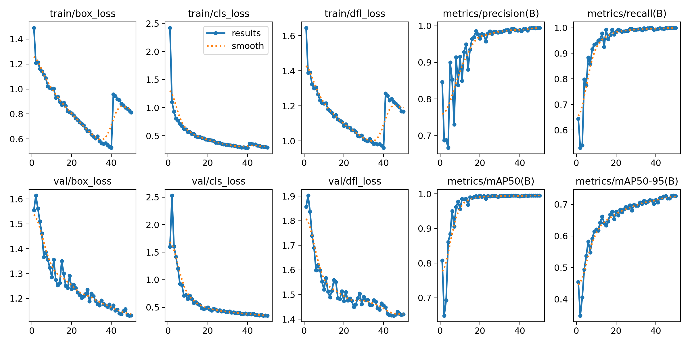
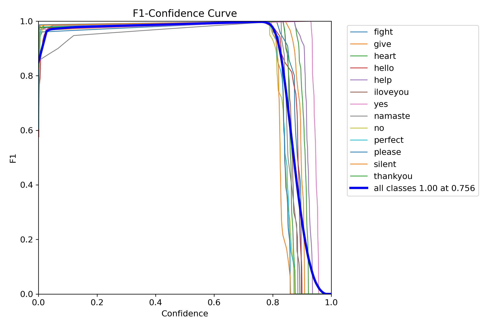

# GestureSpeak: Transforming Signs into Voice


## Table of Contents
1. [Overview](#overview)
2. [Demo](#demo)
3. [Features](#features)
4. [Repository Structure](#repository-structure)
5. [Dataset](#dataset)
6. [Model Training](#model-training)
7. [Algorithms](#algorithms)
7. [Deployment](#deployment)
8. [Installation & Usage](#installation--usage)
9. [Contributors](#contributors)
10. [Acknowledgments](#acknowledgments)
11. [License](#license)

## Overview
GestureSpeak is a web-based system designed to translate sign language gestures into text and speech in real-time. The project utilizes deep learning techniques, including CNNs, EfficientNet, and YOLO, for static image classification and real-time gesture detection.

## Demo
### Project Screenshots


### Accuracy Graphs

[CNN accuracy](accuracy_graphs/Scratch_cnn/scratch_cnn_loss_vs_epoch.png)






## Features
- **Static Image Classification**: Classifies sign language gestures using CNN and EfficientNet models.
- **Real-Time Gesture Detection**: YOLO-based real-time sign detection using a webcam.
- **Text-to-Speech Integration**: Converts recognized text into speech for improved accessibility.
- **Web-Based Interface**: React frontend with Flask backend for seamless user interaction.
- **Custom Dataset**: Includes labeled images for training deep learning models.

## Repository Structure
```
├── Backend                # Flask backend with APIs for classification and detection
│   ├── backend.py        # Main backend script
├── Data_collection       # OpenCV-based data collection scripts
├── Desktop_GUI           # Standalone GUI with text-to-speech
│   ├── main.py           # Main GUI script
├── Frontend              # React-based web interface
├── accuracy_graphs       # Model performance visualization
├── data_preprocessing    # Scripts for dataset preprocessing
├── model_training        # CNN and EfficientNet training scripts
├── models                # Stored models (tracked with Git LFS)
├── yolo_model_training   # YOLO model training scripts
├── .gitattributes        # Config for tracking large model files
├── README.md             # Project documentation
├── requirements.txt      # Required dependencies
```

## Dataset
- **17 Static Signs** for EfficientNet model
- **13 Signs** for YOLO model
- **500–1000 images per sign**
- **Preprocessing Techniques**: Raw images, cropped images, bounding boxes, MediaPipe landmarks

## Model Training
### CNN & EfficientNet
- Custom CNN trained from scratch
- EfficientNet model trained on 17 signs
- Validation Accuracy: **99.26%**

### YOLO Model
- Used YOLOv8 for real-time gesture detection
- Performs exceptionally well

# Algorithms
- **CNN using TensorFlow**: Used for static image classification of sign language gestures.
- **YOLO using PyTorch**: Employed for real-time sign detection via webcam.
- **K-Means Clustering (From Scratch)**: Implemented without external libraries to remove background noise from images.

## Deployment
- **Backend**: Flask REST API serving trained models (`backend.py`)
- **Frontend**: React-based UI for interaction
- **Desktop GUI**: Standalone application (`main.py`)

- **Integration**: Static classification & real-time detection

## Installation & Usage
### Backend
```bash
# Clone the repository
git clone https://github.com/AdarshaRimal/SignLanguageDetection.git
cd GestureSpeak/Backend

# Install dependencies
pip install -r requirements.txt

# Run the backend
python backend.py
```

### Frontend
```bash
cd ../Frontend
npm install
npm start
```

### Desktop GUI
```bash
cd ../Desktop_GUI
python main.py
```

## Contributors
- **Adarsha Rimal** - AI Models & Backend
- **Sagar Gautam** - Frontend Development
- **Shiva Ram Dhakal** - UI/UX & Data Preprocessing

## Acknowledgments
- TensorFlow & PyTorch for deep learning
- OpenCV for data collection
- MediaPipe for hand landmarks
- YOLO for real-time detection

## License
This project is licensed under the MIT License - see the [LICENSE](LICENSE) file for details.

